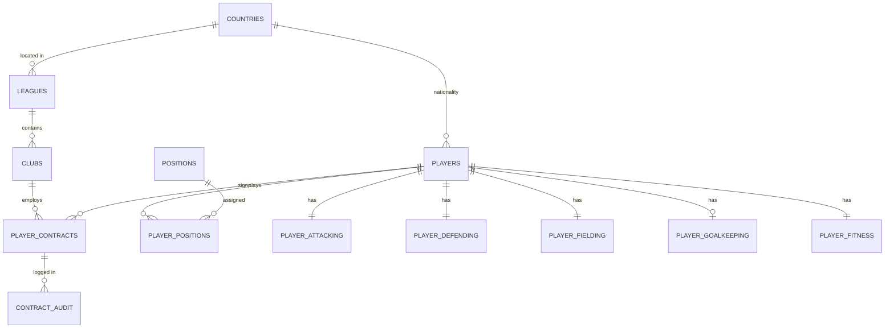

# ⚽ FIFA SQL Database Management

> A production-style relational database built from FIFA player data: normalized PostgreSQL schema, ETL from staging, 15 business use cases, stored logic, and measured query tuning.


---

## 📑 Table of Contents

1. [Project Overview](#-project-overview)
2. [Source Data Analysis](#-source-data-analysis)
3. [Database Architecture](#-database-architecture)
4. [Entity Relationships](#-entity-relationships)
5. [Design Decisions](#-design-decisions)
6. [Use Cases](#-use-cases)
7. [SQL Skills Matrix](#-sql-skills-matrix)
8. [Performance Tuning Plan](#-performance-tuning-plan)
9. [Roadmap](#-roadmap)
10. [Repository Structure](#-repository-structure)
11. [How to Run](#-how-to-run)
12. [Author](#-author)

---

## 📌 Project Overview

Most FIFA projects stop at dashboards. This one starts where the dashboard ends: **how should the data be stored, protected, queried, and made fast?**

The data comes from my Power BI project, [FIFA-Player-Analytics](https://github.com/mahe115/FIFA-Player-Analytics). Its cleaned output is seven flat CSV files. Here they are loaded into a staging layer, validated, and transformed into a **normalized (3NF) relational model** with keys, constraints, indexes, views, stored procedures, and triggers.

**What this project demonstrates**

- Schema design, not just querying an existing schema.
- Advanced analytical SQL: CTEs, window functions, `LATERAL` joins, `ROLLUP`, pivots.
- Reusable database objects: views, functions, stored procedures, triggers.
- Diagnosing a slow query and fixing it with evidence (execution plans and timings).

> 🚧 **Status:** Repository scaffold, schema design, and use-case catalogue are done. Data load, queries, and tuning results are being added phase by phase (see [Roadmap](#-roadmap)).

---

## 🔎 Source Data Analysis

Analysed from the `Cleaned & TransformedTables` folder of FIFA-Player-Analytics:

| Source file | Size | Content | Target table(s) |
|---|---|---|---|
| `playerstats_2024.csv` | ~3.5 MB | Player identity and profile details | `players`, `countries`, `clubs`, `positions` |
| `attacking abilities.csv` | ~5.7 MB | Attacking skill scores | `player_attacking` |
| `defending abilities.csv` | ~5.8 MB | Defending skill scores | `player_defending` |
| `fielding abilities.csv` | ~5.7 MB | Outfield technical and mental scores | `player_fielding` |
| `goalkeeping abilities.csv` | ~4.9 MB | Goalkeeper skill scores | `player_goalkeeping` |
| `economical stats.csv` | ~4.8 MB | Value, wage, release clause | `player_contracts` |
| `playerfitness.csv` | ~0.9 MB | Physical and fitness indicators | `player_fitness` |

**Total: about 31 MB across 7 files.**

**Key observations**

- The data is already split into **one identity table plus six attribute and economic tables**, related through a shared player key. That is a natural one-to-one vertical split, so the model keeps it instead of forcing one wide table.
- Repeating text values such as nationality, club, and position are redundancy targets for normalization.
- Money fields (value, wage, release clause) are often exported as formatted text, so the ETL converts them to numeric columns.

> ℹ️ Exact column names are reconciled against the CSV headers in `docs/data_dictionary.md` during the load phase.

---

## 🏗️ Database Architecture

Three layers, each in its own schema:

```
CSV files ──► stg (staging) ──► core (normalized 3NF) ──► rpt (views, procedures, reports)
             raw text loads     keys + constraints        business-facing objects
```

| Schema | Purpose |
|---|---|
| `stg` | Raw, all-text copies of the 7 CSVs. Nothing is trusted here. |
| `core` | Clean, typed, normalized tables with PK / FK / CHECK / UNIQUE constraints. |
| `rpt` | Views, materialized views, functions, and stored procedures for reporting. |
| `audit` | Change-tracking tables populated by triggers. |

---

## 🔗 Entity Relationships



| Relationship | Cardinality | Implementation |
|---|---|---|
| Country to players | 1 : N | `players.country_id` FK |
| Country to leagues | 1 : N | `leagues.country_id` FK |
| League to clubs | 1 : N | `clubs.league_id` FK |
| Club to contracts | 1 : N | `player_contracts.club_id` FK |
| Player to positions | M : N | Junction table `player_positions` with an `is_primary` flag |
| Player to attribute tables | 1 : 1 (goalkeeping optional) | Shared PK/FK on `player_id` |

Full DDL: [`schema/01_create_schema.sql`](schema/01_create_schema.sql) · Details: [`docs/data_understanding.md`](docs/data_understanding.md)

---

## 🧩 Design Decisions

- **3NF normalization.** Country, club, league, and position become lookup tables, removing repeated strings and update anomalies.
- **Junction table for positions.** Players can play several positions, so a many-to-many table replaces a comma-separated column.
- **Shared primary key for 1:1 tables.** Attribute tables use `player_id` as both PK and FK. No surrogate key is needed and joins stay cheap.
- **Constraints as documentation.** `CHECK (rating BETWEEN 0 AND 100)`, `CHECK (wage_eur >= 0)`, a partial unique index for one primary position per player, and `NOT NULL` where the business requires it.
- **Staging first.** Bad rows are quarantined with rejection reasons instead of failing the whole load.
- **Money as `NUMERIC`.** Never floating point for value, wage, or release clause.

---

## 🎯 Use Cases

Each use case gets its own script in `queries/` and targets a specific SQL skill.

| # | Use case | Business question | SQL skills |
|---|---|---|---|
| 1 | Top N per position | Who are the 5 best players in each position? | CTE, `DENSE_RANK() OVER (PARTITION BY ...)` |
| 2 | Value for money | Which players give the highest rating per euro of value? | Joins, computed columns, `NULLIF` |
| 3 | Club squad report | Average rating, total value, and wage bill per club | `GROUP BY`, `HAVING`, aggregates |
| 4 | League comparison | How do leagues compare on rating and spend? | Multi-table joins, `ROLLUP` |
| 5 | Young talent finder | Under-21 players with the largest potential gap | Filtering, derived metrics |
| 6 | Nationality strength | Which countries produce the most elite players? | Aggregation, `FILTER` clause |
| 7 | Position-relative rating | How does a player compare to their position average? | Window `AVG() OVER` |
| 8 | Rating percentile bands | Bucket players into quartiles and deciles | `NTILE`, `PERCENT_RANK` |
| 9 | Best XI builder | Best 11 players for a 4-3-3 under a budget | CTE, ranking, `LATERAL` join |
| 10 | Undervalued goalkeepers | Top goalkeepers with low market value | Conditional joins, subqueries |
| 11 | Fitness risk report | Players with low fitness and high wage | Multi-table join, filtering |
| 12 | Attribute pivot | Attribute averages by position group as columns | Conditional aggregation / `CROSSTAB` |
| 13 | Repeatable reports | Parameterized "top players by club / position" | Stored function / procedure |
| 14 | Contract change auditing | Log every wage or release-clause change | Trigger, audit table |
| 15 | Safe data corrections | Transfer a player between clubs atomically | Transaction, `SAVEPOINT`, rollback |

**Example: use case 1 (planned)**

```sql
WITH scored AS (
    SELECT p.player_name,
           pos.position_code,
           (a.finishing + a.ball_control + a.dribbling) / 3.0 AS attacking_score
    FROM core.players p
    JOIN core.player_positions pp ON pp.player_id = p.player_id AND pp.is_primary
    JOIN core.positions pos       ON pos.position_id = pp.position_id
    JOIN core.player_attacking a  ON a.player_id = p.player_id
),
ranked AS (
    SELECT *,
           DENSE_RANK() OVER (
               PARTITION BY position_code
               ORDER BY attacking_score DESC
           ) AS rank_in_position
    FROM scored
)
SELECT * FROM ranked WHERE rank_in_position <= 5;
```

---

## 🧠 SQL Skills Matrix

| Category | Skills demonstrated |
|---|---|
| **DDL** | Schemas, data types, PK / FK, CHECK, UNIQUE, defaults, `ON DELETE` rules |
| **Design** | ER modelling, 1NF to 3NF, junction tables, lookup tables |
| **DML / ETL** | Staging loads, `INSERT ... SELECT`, `ON CONFLICT` upserts, data cleansing |
| **Querying** | Inner / left / self joins, subqueries, CTEs, `LATERAL`, set operations |
| **Analytics** | `RANK`, `DENSE_RANK`, `ROW_NUMBER`, `NTILE`, `LAG` / `LEAD`, running totals, `ROLLUP` |
| **Programmability** | Views, materialized views, functions, stored procedures, triggers |
| **Transactions** | `BEGIN` / `COMMIT` / `ROLLBACK`, `SAVEPOINT`, isolation awareness |
| **Performance** | B-tree, composite, partial, and covering indexes; `EXPLAIN (ANALYZE, BUFFERS)` |
| **Security** | Roles `fifa_reader`, `fifa_analyst`, `fifa_admin` with least-privilege grants |
| **Quality** | Validation queries, orphan checks, duplicate detection |

---

## ⚡ Performance Tuning Plan

Results will be recorded in [`docs/performance_tuning.md`](docs/performance_tuning.md).

1. Write a deliberately slow query (multi-join with a function applied to a filtered column).
2. Capture the baseline with `EXPLAIN (ANALYZE, BUFFERS)`.
3. Add targeted indexes (composite, partial, covering) and rewrite non-sargable predicates.
4. Capture the new plan and timing.
5. Record before/after numbers and explain why the plan changed.

| Query | Before (ms) | After (ms) | Change | Technique |
|---|---|---|---|---|
| _to be measured_ | – | – | – | Index / rewrite |

---

## 🧭 Roadmap

- [x] Create repository and define scope
- [x] Analyse source dataset and design entity model
- [x] Draft normalized schema (DDL)
- [x] Define 15 use cases
- [ ] Load 7 CSVs into `stg` and profile data quality
- [ ] Populate `core` tables with cleansing and validation
- [ ] Implement use cases 1 to 12 (analytical queries)
- [ ] Build views, functions, and stored procedures (use case 13)
- [ ] Add triggers and audit trail (use case 14)
- [ ] Add transaction scripts (use case 15)
- [ ] Index tuning with before/after execution plans
- [ ] Role-based access scripts
- [ ] T-SQL (SQL Server) port of key scripts
- [ ] ER diagram image and final insights write-up

---

## 📁 Repository Structure

```
FIFA-SQL-Database-Management/
├── data/                      # CSVs or download instructions
├── schema/
│   ├── 01_create_schema.sql   # Schemas, tables, keys, constraints
│   ├── 02_indexes.sql         # (planned)
│   └── 03_roles.sql           # (planned)
├── etl/                       # Staging load and transform scripts (planned)
├── queries/                   # One script per use case (planned)
├── programmability/           # Views, functions, procedures, triggers (planned)
├── performance/               # Slow vs tuned queries and plans (planned)
├── docs/
│   ├── data_understanding.md
│   ├── performance_tuning.md  # (planned)
│   └── er_diagram.png         # (planned)
├── LICENSE
└── README.md
```

---

## 🚀 How to Run

**Prerequisites:** PostgreSQL 14+ and `psql`, DBeaver, or pgAdmin.

```bash
git clone https://github.com/mahe115/FIFA-SQL-Database-Management.git
cd FIFA-SQL-Database-Management

createdb fifa_db
psql -d fifa_db -f schema/01_create_schema.sql
```

Data load, index, and query scripts will be added and run in numeric order.

---

## 🛠️ Tech Stack

PostgreSQL · SQL Server (T-SQL port planned) · Python / pandas (CSV cleaning) · DBeaver / pgAdmin · Mermaid / dbdiagram.io · Git

---

## 👤 Author

**Mahendran B** · AI/ML Engineer and Python Developer

- GitHub: [@mahe115](https://github.com/mahe115)
- Portfolio: [mahendran-boominathan.vercel.app](https://mahendran-boominathan.vercel.app/)
- Related project: [FIFA-Player-Analytics](https://github.com/mahe115/FIFA-Player-Analytics) (Python + Power BI)

## 📄 License

MIT. See [LICENSE](LICENSE).
